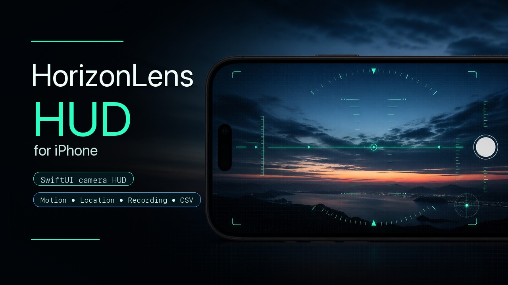

# HorizonLens HUD for iPhone

<p align="center">
  
</p>

HorizonLens HUD for iPhone is an experimental SwiftUI camera HUD app. It overlays aircraft-style flight data on top of the live camera preview and uses iPhone sensors to show attitude, heading, speed, altitude, vertical speed, G load, audio level, a mini map, photo capture, screen recording, and CSV logging.

HorizonLens HUD for iPhone 是一个实验性的 SwiftUI iPhone 相机 HUD 小程序。它以相机实时画面为背景，在上面叠加姿态、航向、速度、高度、垂直速度、G 值、音量电平、小地图、拍照、录屏和 CSV 数据记录等信息。

## Features

- Camera-backed HUD overlay built with SwiftUI and AVFoundation.
- Attitude indicator, bank scale, roll level, heading tape, speed tape, altitude tape, and vertical-speed indicators.
- CoreMotion, CoreLocation, CMAltimeter, MapKit, ReplayKit, AVFoundation, and Photos integration.
- Configurable units, language, HUD color, font size, sensor trims, orientation lock, lens, FPS, and resolution.
- Drag-editable HUD component positions.
- In-memory CSV session logging with export through the iOS share sheet.
- Screen recording that captures the HUD overlay and microphone audio.
- Photo capture and video/photo saving to Photos.

## Requirements

- Xcode 16 or newer is recommended.
- iOS 18.5 or newer, matching the current project deployment target.
- A physical iPhone is strongly recommended. Many features depend on camera, GPS, motion sensors, barometer, microphone, Photos, and ReplayKit, so the simulator cannot fully validate the app.
- An Apple Developer account/team is required for real-device signing.

## Getting Started

1. Clone the repository.
2. Open `HUD2.xcodeproj` in Xcode.
3. Select the `HUD2` scheme.
4. In the target signing settings, choose your own Apple development team.
5. Change the bundle identifier if Xcode reports that it is already in use.
6. Build and run on a physical iPhone.

The public-facing app name is HorizonLens HUD. The Xcode project, scheme, and source folder currently keep the original `HUD2` internal name to avoid unnecessary project churn.

## Artwork

- GitHub cover: `docs/assets/horizonlens-cover.png`
- Square iPhone cover: `docs/assets/horizonlens-iphone-square-cover.png`

## Project Structure

```text
HUD2.xcodeproj/          Xcode project
HUD2/                   App source files and assets
HUD2Tests/              Unit test target
HUD2UITests/            UI test target
```

Important source files:

- `HUD2/HUD2App.swift`: app entry point.
- `HUD2/ContentView_CSV_inMemory_fixed.swift`: main camera, HUD, sensor, recording, and CSV orchestration view.
- `HUD2/AppState_CSVBuffer.swift`: shared UI and logging state.
- `HUD2/HUDOverlay.swift`: HUD overlay layout and draggable widgets.
- `HUD2/SettingsView_CSV_inMemory.swift`: settings and CSV export UI.
- `HUD2/CameraService.swift`: AVFoundation camera, video, photo, lens, FPS, and resolution handling.
- `HUD2/ScreenRecorder.swift`: ReplayKit screen recording.
- `HUD2/LocationService.swift`, `HUD2/HeadingService.swift`, `HUD2/MotionService.swift`, `HUD2/AltimeterService.swift`: sensor services.

## Permissions

The app requests these iOS permissions:

- Camera: live camera preview.
- Microphone: audio level and recording audio.
- Location: speed, altitude, heading fallback, map, and track.
- Motion: attitude and G data.
- Photos add-only access: saving videos and photos.
- Bluetooth: reserved for possible external sensor support.

Review the privacy strings in the Xcode target build settings before shipping or redistributing a build.

## Important Notes

- This project is experimental and is not a certified flight, driving, navigation, rescue, or safety instrument.
- Do not rely on this app for aviation, vehicle operation, navigation decisions, or any safety-critical use.
- Sensor readings can drift, lag, be unavailable, or be inaccurate depending on hardware, permissions, calibration, orientation, GPS quality, and environmental conditions.
- CSV logging is currently in memory for the active session. Long sessions can increase memory usage.
- ReplayKit screen recording behavior depends on iOS permissions and system restrictions.
- The simulator is useful for UI checks only; it is not enough to validate sensor behavior.
- Before public release, test on the exact devices and iOS versions you intend to support.
- The checked-in project is prepared for open-source development; each developer should set their own signing team and bundle identifier locally.

## License

This project is released under the MIT License. See `LICENSE` for details.
